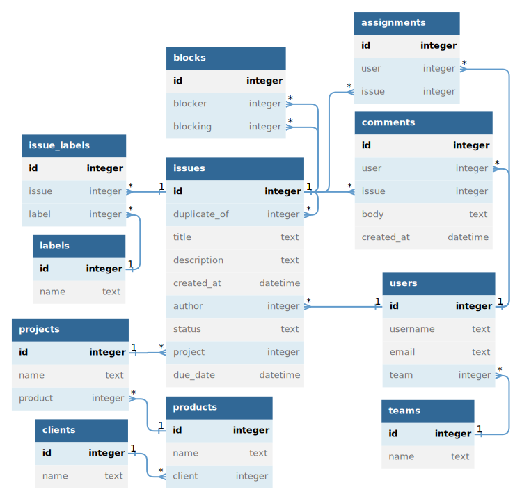

# Querydown Language Guide

_Also see the **[Cheat Sheet](./cheat-sheet.md)** for a quicker reference._

<!-- START doctoc generated TOC please keep comment here to allow auto update -->
<!-- DON'T EDIT THIS SECTION, INSTEAD RE-RUN doctoc TO UPDATE -->

- [Example schema](#example-schema)
- [Query anatomy](#query-anatomy)
- [Values](#values)
  - [Identifiers (table names and column names)](#identifiers-table-names-and-column-names)
  - [Flexible identifiers](#flexible-identifiers)
  - [Built-in constants](#built-in-constants)
  - [String literals](#string-literals)
  - [Flagged strings](#flagged-strings)
  - [Date literals](#date-literals)
  - [Duration literals](#duration-literals)
- [Computations](#computations)
  - [Arithmetic](#arithmetic)
  - [Function piping](#function-piping)
  - [Case expressions](#case-expressions)
  - [Anonymous functions](#anonymous-functions)
  - [Function calling](#function-calling)
- [Conditions](#conditions)
  - [AND condition sets](#and-condition-sets)
  - [OR condition sets](#or-condition-sets)
  - [Nested condition sets](#nested-condition-sets)
  - [Comparison operators](#comparison-operators)
  - [Comparison expansion](#comparison-expansion)
  - [Dual expansion](#dual-expansion)
  - [Ranges](#ranges)
- [Result columns](#result-columns)
  - [Aliasing result columns](#aliasing-result-columns)
  - [Basic sorting](#basic-sorting)
  - [Descending sorting](#descending-sorting)
  - [Multiple sorting](#multiple-sorting)
  - [Sorting NULL values](#sorting-null-values)
  - [Grouping and aggregation](#grouping-and-aggregation)
  - [Column globs](#column-globs)
  - [Column glob on related table](#column-glob-on-related-table)
  - [Hiding columns within a glob](#hiding-columns-within-a-glob)
  - [Sorting columns within a glob](#sorting-columns-within-a-glob)
- [Referencing _single_ related records](#referencing-_single_-related-records)
  - [Single related records via column name chains](#single-related-records-via-column-name-chains)
  - [Single related records via table name](#single-related-records-via-table-name)
  - [One-to-one relationships](#one-to-one-relationships)
  - [Single records related through multi-column foreign keys](#single-records-related-through-multi-column-foreign-keys)
- [Referencing _multiple_ related records](#referencing-_multiple_-related-records)
  - [Mandatory aggregation](#mandatory-aggregation)
  - [Aggregate counts](#aggregate-counts)
  - [Specifying an aggregate function](#specifying-an-aggregate-function)
  - ["Has some" and "has none" conditions](#has-some-and-has-none-conditions)
  - [Conditions to filter aggregate data](#conditions-to-filter-aggregate-data)
  - [Transitive relationships](#transitive-relationships)
  - [Related tables with single vs multiple records](#related-tables-with-single-vs-multiple-records)
  - [Ambiguous paths](#ambiguous-paths)
  - [Intersecting paths](#intersecting-paths)
  - [Specifying the linking column](#specifying-the-linking-column)
- [Pipeline of multiple queries](#pipeline-of-multiple-queries)
- [Union of multiple queries](#union-of-multiple-queries)
- [Window functions](#window-functions)
- [Variables](#variables)
  - [User-defined constants](#user-defined-constants)
  - [Defining a constant using the result of a query](#defining-a-constant-using-the-result-of-a-query)
  - [Computed columns](#computed-columns)
  - [User-defined functions](#user-defined-functions)
  - [Function containing an assignment](#function-containing-an-assignment)
  - [Table-scoped functions](#table-scoped-functions)
  - [Function call expansion](#function-call-expansion)
  - [User-defined tables](#user-defined-tables)
- [Metadata](#metadata)
  - [Column-level metadata](#column-level-metadata)
  - [Query-level metadata](#query-level-metadata)
- [Limit and offset](#limit-and-offset)
- [Modules](#modules)

<!-- END doctoc generated TOC please keep comment here to allow auto update -->

## Example schema

These examples use an fictitious **[issue-tracker schema](../compiler/resources/test/issue_schema.json)** (unless otherwise noted).



_(ER diagram generated via https://dbdiagram.io/d/64a1d25202bd1c4a5e5fefba)_

## Query anatomy

```qd
 #issues   status:"open" due_date:<@now   $id $title $author.*   /*
╰───────╯ ╰────────────────────────────╯ ╰────────────────────╯   *
Base table          Conditions               Result columns       */
```

- The **base table** always comes first. Every query has one and only one base table.
- **[Conditions](#conditions)** can follow the base table, separated by spaces. If omitted, then all rows in the table are returned.
- **[Result columns](#result-columns)** are specified via expressions following a dollar sign `$`. If omitted, then all columns in the table are returned.
- A query with conditions _and_ result columns must specify them in that order.
- Most white space doesn't matter.
- Comments are possible with `//` for single line or `/* */` for multi-line


## Values

### Identifiers (table names and column names)

- Table names are always prefixed with a `#` sigil, e.g. `#issues`
- Column names are written as-is, e.g. `due_date`.
- Identifiers can include special characters when quoted with backticks e.g. `` `Due Date` ``.
- Unquoted identifiers must:
    - begin with a lowercase letter or uppercase letter or underscore
    - include only letters, numbers, and underscores.
- Unlike SQL, column names like `group` and `year` don't need quotes because there are no keywords and functions names are always clear to the parser from other syntax.

### Flexible identifiers

Table and column names are resolved "flexibly" to reduce (but not entirely eliminate) the need for quoting identifiers in backticks.

If a table or column isn't found exactly as specified, then the compiler attempts to find a _unique_ match with a flexible strategy comparing only lowercased ASCII letters and numbers. This means that `foo_bar` will resolve to `Foo Bar`, but only if it doesn't also resolve to any other identifiers like `foobar`.

_(This behavior will likely be configurable in a future version.)_

### Built-in constants

| Querydown | SQL |
| -- | -- |
| `@now`      | `now()`    |
| `@infinity` | `INFINITY` |
| `@true`     | `TRUE`     |
| `@false`    | `FALSE`    |
| `@null`     | `NULL`     |

Additional constants can be [defined](#user-defined-constants).

### String literals

| Example | Explanation |
| -- | -- |
| `"foo"` | With double quotes |
| `'foo'` | With single quotes |

- Strings can be quoted with single quotes or double quotes
- String are raw by default. For example, the sequence `\n` will be interpreted literally instead of as a newline. _(🚧 needs implementation changes)_
- Strings may span multiple lines.

### Flagged strings

_(🚧 Not yet implemented)_

Strings can be prefixed with multiple flags to alter their behavior.

| Example | Explanation |
| -- | -- |
| `^f"Hello {username}!"`   | F-strings style formatting interpolation |
| `^e'Don\'t say "never"'` | Using the `e` flag to interpret escape sequences |
| `^^Don't say "never"^`   | Using a custom quote character to avoid escape sequences |

| Flag | Meaning |
| --   | -- |
| `f`  | **formatting** (aka interpolation) via `{ }` |
| `e`  | interpret **escape** sequences (default is raw) |

- The block of all flags must be prefixed with `^`.
- Multiple flags can be applied to the same string.
- The flags block can also be empty, meaning that `^` is allowed to prefix a string. This is said to be a "flagged string", even if no flags are present.
- Flagged strings may be quoted with any of the following characters: `" ' ^ # / | @`

### Date literals

Literal dates and timestamps can be written in [ISO-8601](https://en.wikipedia.org/wiki/ISO_8601) format with a `@` prefix. For example:

- `@2000-01-01`
- `@2000-01-01T08:30:00`

### Duration literals

Literal durations can be written in case-insensitive [ISO-8601](https://en.wikipedia.org/wiki/ISO_8601#Durations) without the `P` prefix and with a `@` prefix.

| Example | Meaning |
| --      | -- |
| `@2y`   | 2 years |
| `@2.5y` | 2.5 years |
| `@1y2d` | 1 year and 2 days |
| `@9m`   | 9 months |
| `@t9m`  | 9 minutes |
| `@t1h`  | 1 hour |
| `@0y`   | (empty) |


## Computations

### Arithmetic

Basic arithmetic operators are supported in expressions, along with their standard precedence.

| Operator | Meaning |
| -- | -- |
|  `+` | Addition |
|  `-` | Subtraction |
|  `*` | Multiplication |
|  `/` | Division |

No other operators exist. All other functions must be applied by name.

### Function piping

Functions can be applied to values via `|` (pipe) syntax.

> Show issues, along with the number of days until the due date.

```qd
#issues $* $due_date|away|days
```

- See a list of [all named functions](./functions.md).
- Pipe has the highest [operator precedence](./cheat-sheet.md#operator-precedence), meaning that it gets evaluated before multiplication or division.

### Case expressions

_(🚧 Not yet implemented)_

- `?` begins a case expression.
- `~` denotes a case variant and separates a test expression (first) from a corresponding value expression (second).
- `~~` prefixes the fallback value and indicates the end of the case expression.

> Categorize each issue into being either "overdue", "due soon", or "due later".

```qd
#issues
$title
$ ?
  due_date|away|days:<0  ~ "overdue"
  due_date|away|days:<30 ~ "due soon"
  ~~                       "due later"
```

### Anonymous functions

_(🚧 Not yet implemented)_

> Categorize each issue into being either "overdue", "due soon", or "due later".

```qd
#issues
$title
$due_date|away|days|(@d; ? @d:<0~"overdue" @d:<30~"due soon" ~~"due later")
```

In the code above:

1. `due_date|away|days` computes the number of days until the issues's due date
1. That value is fed into the `@d` argument of the anonymous function:

    ```
    (@d; ? @d:<0~"overdue" @d:<30~"due soon" ~~"due later")
    ```

1. The anonymous function can `@d` in reference to the number of days until the issues due date, using the same value in multiple places with minimal repetition.

### Function calling

_(🚧 Not yet implemented)_

Use `@@` to call a function without using a pipe.

> For each issue, show the number of days it is overdue. Display zero instead of negative numbers

```qd
#issues $title $@@max(due_date|age|days 0)
```

Notice:

- The `max` function is prefixed with the `@@` sigil.
- It takes two arguments which are separated by _space_. No commas!

The above query is equivalent to:

```qd
#issues $title $due_date|age|days|max(0)
```

Sometimes the pipe syntax is more readable. Other times the direct call is more readable, especially when using [table-scoped functions](#table-scoped-functions).

## Conditions

### AND condition sets

Curly brackets `{ }` enclose multiple `AND` conditions.

> Issues that are open **and** created after 2023-03-04

```qd
#issues {status:"open" created_at:>@2023-03-04}
```

At the top level, a set of AND conditions is inferred if no brackets are present, so the above query is identical to:

```qd
#issues status:"open" created_at:>@2023-03-04
```

### OR condition sets

Square brackets `[ ]` enclose `OR` conditions.

> Issues that are open **or** created after 2023-03-04

```qd
#issues [status:"open" created_at:>@2023-03-04]
```

### Nested condition sets

Conditions can be nested

> Issues that are open and created after 2023-03-04 _or_ reopened and created after 2022-11-22:

```qd
#issues [
  {status:"open" created_at:>@2023-03-04}
  {status:"reopened" created_at:>@2022-11-22}
]
```

### Comparison operators

the Cheat Sheet lists all [comparison operators](./cheat-sheet.md#comparison-operators).


### Comparison expansion

The `..` syntax can be use to "expand" comparisons into bracketed condition sets.

> Issues whose status is either "open" or "reopened":

```qd
#issues status:..["open" "reopened"]
```

> Issues that are missing a title and description:

```qd
#issues {title description}..:@null
```

> Issues where the title or description contains "foo":

```qd
#issues [title description]..:~"foo"
```

### Dual expansion

If both sides of the comparison are expanded, then the brackets on left side are used for the outer precedence

> Issues where the title and description both contain "foo" or contain "bar":

```qd
#issue {title description}..:~..["foo" "bar"]
```

### Ranges

> Issues created in the 2010's decade

```qd
#issues created_at|year:2010..2019
```

The range `2010..2019` **includes** both 2010 and 2019. You can use `<` on either side of the `..` to make the range exclude either of the bounds. For example:

- `2010<..2019` means _"greater than 2010 and less or equal to 2019"._
- `2010..<2019` means _"greater or equal to 2010 and less than 2019"._
- `2010<..<2019` means _"greater than 2010 and less than 2019"._


## Result columns

### Aliasing result columns

Use `->` after a column to give it an alias.

```qd
#issues $id->Identifier $title->Subject
```

### Basic sorting

Ascending sorting by one column. The `s` stands for "sort".

> Issues sorted by their creation date

```
#issues $title $created_at \s
```

### Descending sorting

Descending sorting is indicated via a `d` after the `s`.

```
#issues $title $created_at \sd
```

### Multiple sorting

Sorting by multiple columns is done via numbers to indicate ordinality.

```
#issues $title \s2 $created_at \sd1
```

Sorted columns without any ordinality specified are sorted in the order the appear, after all columns with indicated ordinality.

### Sorting NULL values

By default, `NULL` values are sorted last, but this behavior can be modified using the `n` flag, which stands for "nulls first".

```
#issues $title $created_at \sdn
```

### Grouping and aggregation

_(🚧 Not yet implemented)_

Grouping is indicated by the `g` flag, similar to sorting.

> For each issue status, show the number of issues and the date of the most recently created issue

```
#issues $status \g $%count $created_at%max
```

- All ungrouped columns must contain an aggregate function
- `%count` can occur on its own (outside of a function pipeline), which is equivalent to `count(*)`.
- Grouping by multiple columns is done via `\g1` and `\g2`, similar to sorting.

### Column globs

Use `$*` to specify all columns. This gives you control to add a column after all columns.

> Show all issues columns, and also show the number of days until each issue's due date

```
#issues $* $due_date|away|days
```

### Column glob on related table

> Show all issues columns, and also all users columns for the issue's author

```
#issues $* $author.*
```

### Hiding columns within a glob

You can add parentheses after `*` and use expressions plus flags to alter the behavior of columns.

Use `\h` to hide a column.

> Issues with all columns except description:

```
#issues $*(description \h)
```

### Sorting columns within a glob

Use `\s` (and similar flags) to sort by columns, leaving their position in the table unchanged.

```
#issues $*(created_at \sd)
```


## Referencing _single_ related records

### Single related records via column name chains

When a column links to another table, the `.` character can be used after the column to refer to columns in the related table.

> Issues created by members of the backend team, displaying the issue title and author's username

```
#issues author.team.name:"Backend" $id $title $author.username
```

### Single related records via table name

You can also refer to related tables by name.

> All issues associated with the "Foo" client.

```
#issues >>#clients.name:"Foo"
```

This expands to:

```
#issues project.product.client.name:"Foo"
```

The `>>` syntax is shorthand only works if there is one unambiguous path from the base table to the linked table. The longer form is required if there is more than one way to join the two tables.

### One-to-one relationships

_(🚧 Not yet implemented)_

The `>>` syntax can also be used bidirectionally for one-to-one relationships to satisfy the use case when a single related record cannot be referenced by a column.

### Single records related through multi-column foreign keys

_(🚧 Not yet implemented)_

If the relationship uses a multi-column foreign key, then any of the foreign key columns can be used in a column name chain.

## Referencing _multiple_ related records

### Mandatory aggregation

In querydown (unlike SQL) all joined data is aggregated with respect to the base table, meaning the result set will never have more more rows than the base table. This fundamental design has the benefit of making queries simpler and more obvious. However it also limits the capabilities of Querydown compared to SQL. That's okay because Querydown is not trying to make it possible to write _all_ the queries you could write with SQL &mdash; it's just trying to make it _easier_ to write _most_ of the queries you could write with SQL.

### Aggregate counts

> Show the number of issues associated with each project

```
#projects $name $#issues
```

In our [example schema](#example-schema), each project has multiple issues. When the base table is `#projects`, the expression `#issues` means: _count the number of issues related to each project_.

### Specifying an aggregate function

Specific aggregate functions can be applied via `%` (similar to pipe syntax).

> For each project, show the date of the most recently created issue

```
#projects $name $#issues.created_at%max
```

_(See a list of [all aggregate functions](./functions.md#aggregate-functions).)_

### "Has some" and "has none" conditions

You can use the `++` and `--` shorthand syntax to construct conditions based on aggregate counts.

> Projects that have at least one related issue

```
#projects ++#issues
```

This expands to 

```
#projects #issues:>0
```

> Projects that have no related issues

```
#projects --#issues
```

This expands to 

```
#projects #issues:0
```

### Conditions to filter aggregate data

You can add a condition block after any aggregated table

> Projects that have no open issues

```
#projects --#issues{status:"open"}
```

### Transitive relationships

You can refer to distantly-related tables

> Show the number of issues associated with each client

```
#clients $name $#issues
```

Here, the `issues` table is not directly related to the `clients` table, but that's okay. The above code is shorthand for the following:

```
#clients $name $#products.#projects.#issues
```

The shorthand works in this case because there is only one path through which `clients` can be joined to `issues`. **Querydown will choose the shortest unambiguous path it can find.**

### Related tables with single vs multiple records

In our schema, the following query does not work. Let's see why

> Attempt to show the number of projects associated with each issue

```qd
#issues $title $#projects // ERROR!
```

This query gives an error because the schema only permits each issue to have _one_ project (not multiple).

A similar query would be this:

> Show the project name for each issue

```qd
#issues $title $>>#projects.name
```

Here, we've used `>>` to [reference a single related record via table name](#single-related-records-via-table-name). This works. And could write that same query a bit more simply using [column name chains](#single-related-records-via-column-name-chains).

```qd
#issues $title $project.name
```

To summarize:

- `#projects` refers to a related `projects` table with **many** records.
- `>>#projects` refers to a related `projects` table with **one** record.

### Ambiguous paths

If the related table can be joined via multiple routes which tie as being the shortest path, then Querydown will throw an error.

> Attempt to display the number of users associated with each issue.

```
#issues $id $title $#users // ERROR!
```

This doesn't work because the relationship graph has more than one path to reach _"multiple `users` records"_ which ties for being the shortest path. From `issues`, we can find _"multiple `users` records"_ either through the `assignments` table or through the `comments` table. Both paths require one extra hop between `issues` and `users`, so the paths are the same length and the compiler doesn't know which one to choose.

This works:

> The number of users _who are assigned_ to each issue

```
#issues $id $title $#assignments.#users
```

This also works:

> The number of unique users _who have commented_ on each issue

```
#issues $id $title $#comments.#users.id%count_distinct
```

### Intersecting paths

Paths to data can traverse the relationship graph in ways that visit the same table multiple times, so long as each path segment in the Querydown code specifies an unambiguous route between two nodes.


> Issues, shwo

> Issues, showing the most recent date on which any of the comment authors have created issues

```qd
#issues $* $author.#comments.issue.created_at%max
```

Here, we begin at `issues`, then hop to `users`, `comments`, and finally back to `issues`. This works because we've specified all the intermediate destinations unambiguously.

For comparison, here is a different query...

```qd
#issues $* $#issues.created_at%max
```

Here, we've said, _"begin at the `issues` table, and find the shortest unambiguous path back to the `issues` table which yields multiple records."_ 

### Specifying the linking column

If one table directly links to another table multiple times, then parentheses must be used to specify which linking column to use.

> Issues that are not blocking any other issues

```
#issues --#blocks(blocker)
```

> Issues that are not blocked by any other issues

```
#issues --#blocks(blocking)
```


## Pipeline of multiple queries

_(🚧 Not yet implemented)_

> For each project, count the number of months in which at least 10 issues were created

```qd
#issues $project \g $created_at|year_month \g $%count -> issue_count
~~~
issue_count:>=10 $project \g $%count
```


## Union of multiple queries

_(🚧 Not yet implemented)_

The `+++` operator performs an SQL `UNION`, appending the results of one query to the results of another.

> List all the issues related to issue 1234, along with the way in which they are related

```qd
#issues duplicate_of:1234
$id
$title
$created_at
$"Duplicate"
+++
#blocks blocker:1234
$blocking.id
$blocking.title
$created_at
$"Dependent"
+++
#blocks blocking:1234
$blocker.id         -> id
$blocker.title      -> title
$blocker.created_at -> created_at
$"Dependency"       -> relationship
~~~
$*(created_at \s)
```

Note:

- The quantity and types of result column must be identical on both sides of the union.
- Column aliases are taken from the last query in a union.
- Union has higher precedence than pipeline (the union will be performed before the pipeline). [User-defined tables](#user-defined-tables) can be used if you need a pipeline within a union.


## Window functions

_(🚧 Not yet implemented)_

Windows are defined via `%%( )`. Inside the parentheses, you use the same syntax as with [column globs](#column-globs), but one additional flag is available: `\p` for "partition".

After the window definition, you apply an aggregate function, such as `row_number`, `lag`, `dense_rank`, etc.

> Find issues which have a lot of sequential comments from the same user. Show the max number of sequential comments within the issue, along with the names of all the users who tied for making that many sequential comments:

```qd
#comments
$issue
$user
$%%(issue\p user\p created_on\s)%row_number -> cumulative_total
~~~
%%(issue\p cumulative_total\sd)%row_number:1
$issue \g
$cumulative_total
$user.username%list
```

## Variables

### User-defined constants

_(🚧 Not yet implemented)_

> Show the issues created by user 1234

```qd
@user_id = 1234
#issues author:@user_id
```

### Defining a constant using the result of a query

_(🚧 Not yet implemented)_

> Find issues created after the the most recent comment was created

```qd
@date_of_latest_comment = #( #comments created_at%max )
#issues created_at:>date_of_latest_comment
```

### Computed columns

_(🚧 Not yet implemented)_

```qd
#users.age = birth_date|age|years|floor
#users.can_purchase_alcohol = age:>=21
#users $* $can_purchase_alcohol
```

### User-defined functions

_(🚧 Not yet implemented)_

> Given a fiscal year which begins on February 1st, find issues that were opened in fiscal-year 2020 and marked due in 2021

```qd
@@fiscal_year = @date; (@date - @1M)|year
#issues created_at|fiscal_year:2020 due_date|fiscal_year:2021
```

### Function containing an assignment

_(🚧 Not yet implemented)_

```qd
@@generation = @birth_date;
  @birth_year = @birth_date|year
  ? @birth_year:>=2010 ~ "Alpha"
    @birth_year:>=1997 ~ "Z"
    @birth_year:>=1981 ~ "Millennial"
    @birth_year:>=1965 ~ "X"
    @birth_year:>=1946 ~ "Boomer"
    @birth_year:>=1928 ~ "Silent"
    @birth_year:>=1901 ~ "Greatest"
    @birth_year:>=1883 ~ "Lost"
    ~~ @null

#users $birth_date|generation \g $%count
```

### Table-scoped functions

_(🚧 Not yet implemented)_

When functions are scoped to a specific table during definition, the function body can refer to columns and relationships from that table.

> Find issues that involve a user named "alice" (via assignment, comment, or authorship) and match the search terms "accessibility" (via title, description, or comment body).

```qd
#issues.@@involves = @username; [
  ++#assignments{user.username:@username}
  ++#comments{author.username:@username}
  author.username:@username
]
#issues.@@matches = @term; [
  ++#comments{body:~@term}
  title:~@term
  description:~@term
]
#issues @@involves("alice") @@matches("accessibility")
```

### Function call expansion

_(🚧 Not yet implemented)_

We can extend the above example as follows:

> Find issues that involve both users named "alice" and "bob" (via assignment, comment, or authorship) and match either of the search terms "a11y" or "accessibility" (via title, description, or comment body).

```qd
// ... last line from previous example modified to become:

#issues @@involves{"alice" "bob"} @@matches["a11y" "accessibility"]
```

_(Function call expansion works with built-in functions too! It's documented here because it's most likely to be useful with user-defined functions that return boolean values.)_

### User-defined tables

_(🚧 Not yet implemented)_

> For each project, count the number of months in which at least 10 issues were created

```qd
#project_months = #(
  #issues $project \g $created_at|year_month \g $%count -> issue_count
)
#project_months issue_count:>=10 $project \g $%count
```

## Metadata

### Column-level metadata

_(🚧 Not yet implemented)_

> Show all columns in the `issues` table. Also associate `{"width": 100}` as JSON metadata with the `title` column. This metadata will get passed through as output from the Querydown compiler, separate from the SQL output.

```qd
#issues $*(title \{"width": 100})
```

### Query-level metadata

_(🚧 Not yet implemented)_

> Show all issues. Also associate `{"foo": 100}` as JSON metadata with the query. This metadata will get passed through as output from the Querydown compiler, separate from the SQL output.

```qd
#issues \\\{"foo": 100}
```

## Limit and offset

_(🚧 Not yet implemented)_

Limits and offsets are specified as options to the Querydown compiler. This gives pagination control to the _application_ instead of the query author.

## Modules

_(🚧 Not yet implemented. This design is still quite rough as well!)_

All user-defined variables are private by default.

Examples:

- In module `foo/bar`:

    Use `===` export the definition of `#issues.@@involves` (a [user-defined table-scoped function](#table-scoped-functions))

    ```qd
    === #issues.@@involves = @username; [
      ++#assignments{user.username:@username}
      ++#comments{author.username:@username}
      author.username:@username
    ]
    ```

- In another module, import and use `#issues.@@involves`

    ```qd
    <<< foo/bar(#issues.@@involves)

    #issues @@involves("alice")
    ```

- Or, import it but alias it as `has` instead

    ```qd
    <<< foo/bar(#issues.@@involves->has)

    #issues @@has("alice")
    ```

- Or, import _all exports_ from `foo/bar`

    ```qd
    <<< foo/bar(*)

    #issues @@involves("alice")
    ```

- Re-export an import

    ```qd
    === ./foo/bar(*)
    ```
