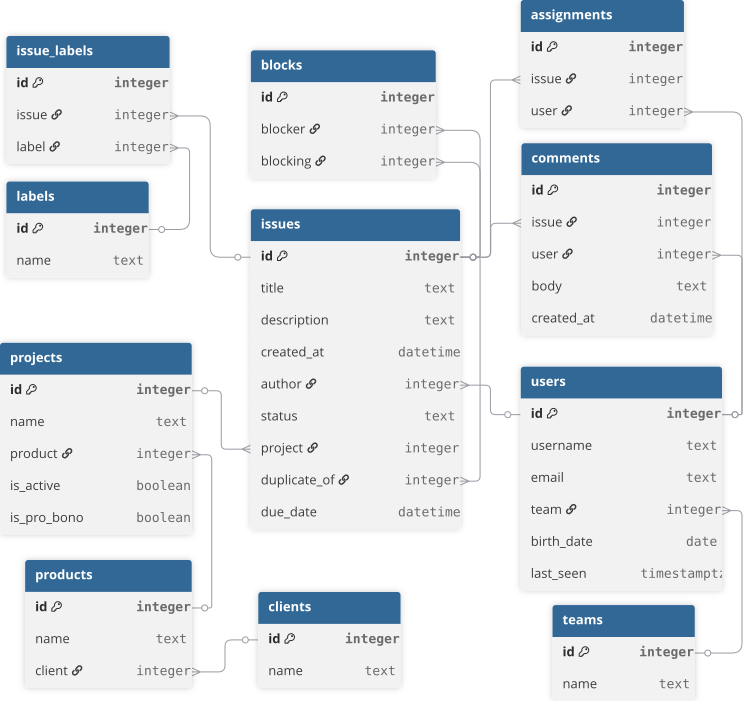

# Querydown Language Guide

_Also see the **[Cheat Sheet](./cheat-sheet.md)** for a quicker reference._

<!-- START doctoc generated TOC please keep comment here to allow auto update -->
<!-- DON'T EDIT THIS SECTION, INSTEAD RE-RUN doctoc TO UPDATE -->

- [Example schema](#example-schema)
- [Query anatomy](#query-anatomy)
- [Values](#values)
  - [Identifiers (table names and column names)](#identifiers-table-names-and-column-names)
  - [Flexible identifiers](#flexible-identifiers)
  - [Built-in constants](#built-in-constants)
  - [String literals](#string-literals)
  - [Flagged strings](#flagged-strings)
  - [Date literals](#date-literals)
  - [Duration literals](#duration-literals)
- [Computations](#computations)
  - [Arithmetic](#arithmetic)
  - [Function piping](#function-piping)
  - [Case expressions](#case-expressions)
  - [Anonymous functions](#anonymous-functions)
  - [Function calling](#function-calling)
- [Conditions](#conditions)
  - [AND condition sets](#and-condition-sets)
  - [OR condition sets](#or-condition-sets)
  - [Nested condition sets](#nested-condition-sets)
  - [Comparison operators](#comparison-operators)
  - [Comparison expansion](#comparison-expansion)
  - [Dual expansion](#dual-expansion)
  - [Ranges](#ranges)
- [Result columns](#result-columns)
  - [Aliasing result columns](#aliasing-result-columns)
  - [Basic sorting](#basic-sorting)
  - [Descending sorting](#descending-sorting)
  - [Multiple sorting](#multiple-sorting)
  - [Sorting NULL values](#sorting-null-values)
  - [Grouping and aggregation](#grouping-and-aggregation)
  - [Column globs](#column-globs)
  - [Column glob on related table](#column-glob-on-related-table)
  - [Hiding columns within a glob](#hiding-columns-within-a-glob)
  - [Sorting columns within a glob](#sorting-columns-within-a-glob)
- [Referencing _single_ related records](#referencing-_single_-related-records)
  - [Single related records via column name chains](#single-related-records-via-column-name-chains)
  - [Single related records via table name](#single-related-records-via-table-name)
  - [One-to-one relationships](#one-to-one-relationships)
  - [Single records related through multi-column foreign keys](#single-records-related-through-multi-column-foreign-keys)
- [Referencing _multiple_ related records](#referencing-_multiple_-related-records)
  - [Mandatory aggregation](#mandatory-aggregation)
  - [Aggregate counts](#aggregate-counts)
  - [Specifying an aggregate function](#specifying-an-aggregate-function)
  - ["Has some" and "has none" conditions](#has-some-and-has-none-conditions)
  - [Conditions to filter aggregate data](#conditions-to-filter-aggregate-data)
  - [Transitive relationships](#transitive-relationships)
  - [Related tables with single vs multiple records](#related-tables-with-single-vs-multiple-records)
  - [Ambiguous paths](#ambiguous-paths)
  - [Intersecting paths](#intersecting-paths)
  - [Specifying the linking column](#specifying-the-linking-column)
- [Pipeline of multiple queries](#pipeline-of-multiple-queries)
- [Union of multiple queries](#union-of-multiple-queries)
- [Window functions](#window-functions)
- [Variables](#variables)
  - [User-defined constants](#user-defined-constants)
  - [Defining a constant using the result of a query](#defining-a-constant-using-the-result-of-a-query)
  - [Computed columns](#computed-columns)
  - [User-defined functions](#user-defined-functions)
  - [Function containing an assignment](#function-containing-an-assignment)
  - [Table-scoped functions](#table-scoped-functions)
  - [Function call expansion](#function-call-expansion)
  - [User-defined tables](#user-defined-tables)
- [Annotations](#annotations)
  - [Column-level annotations](#column-level-annotations)
  - [Query-level annotations](#query-level-annotations)
- [Limit and offset](#limit-and-offset)
- [Modules](#modules)

<!-- END doctoc generated TOC please keep comment here to allow auto update -->

## Example schema

These examples use an fictitious **[issue-tracker schema](../compiler/resources/test/issue_schema.json)** (unless otherwise noted).



_(ER diagram generated via https://dbdiagram.io/d/64a1d25202bd1c4a5e5fefba)_

## Query anatomy

```qd
 #issues   status:"open" due_date:<@now   $id $title $author.*   /*
╰───────╯ ╰────────────────────────────╯ ╰────────────────────╯   *
Base table          Conditions               Result columns       */
```

- The **base table** always comes first. Every query has one and only one base table.
- **[Conditions](#conditions)** can follow the base table, separated by spaces. If omitted, then all rows in the table are returned.
- **[Result columns](#result-columns)** are specified via expressions following a dollar sign `$`. If omitted, then all columns in the table are returned.
- A query with conditions _and_ result columns must specify them in that order.
- Most white space doesn't matter.
- Comments are possible with `//` for single line or `/* */` for multi-line


## Values

### Identifiers (table names and column names)

- Table names are always prefixed with a `#` sigil, e.g. `#issues`
- Column names are written as-is, e.g. `due_date`.
- Identifiers can include special characters when quoted with backticks e.g. `` `Due Date` ``.
- Unquoted identifiers must:
    - begin with a lowercase letter or uppercase letter or underscore
    - include only letters, numbers, and underscores.
- Unlike SQL, column names like `group` and `year` don't need quotes because there are no keywords and functions names are always clear to the parser from other syntax.
- Note that a bare (unquoted) word on the [right-hand-side of a comparison](#bare-text-on-the-right-hand-side-of-a-comparison) is parsed as a string literal, not a column reference. Use backticks there if you need to reference a column.

### Flexible identifiers

Table and column names are resolved "flexibly" to reduce (but not entirely eliminate) the need for quoting identifiers in backticks.

If a table or column isn't found exactly as specified, then the compiler attempts to find a _unique_ match with a flexible strategy comparing only lowercased ASCII letters and numbers. This means that `foo_bar` will resolve to `Foo Bar`, but only if it doesn't also resolve to any other identifiers like `foobar`.

_(This behavior will likely be configurable in a future version.)_

### Built-in constants

| Querydown | SQL |
| -- | -- |
| `@now`      | `now()`    |
| `@infinity` | `CAST('infinity' AS double precision)` |
| `@true`     | `TRUE`     |
| `@false`    | `FALSE`    |
| `@null`     | `NULL`     |

Additional constants can be [defined](#user-defined-constants).

### String literals

| Example | Explanation |
| -- | -- |
| `"foo"` | With double quotes |
| `'foo'` | With single quotes |

- Strings can be quoted with single quotes or double quotes
- String are raw by default. For example, the sequence `\n` will be interpreted literally instead of as a newline. _(🚧 needs implementation changes)_
- Strings may span multiple lines.

### Flagged strings

_(🚧 Not yet implemented)_

Strings can be prefixed with multiple flags to alter their behavior.

| Example | Explanation |
| -- | -- |
| `^f"Hello {username}!"`   | F-strings style formatting interpolation |
| `^e'Don\'t say "never"'` | Using the `e` flag to interpret escape sequences |
| `^^Don't say "never"^`   | Using a custom quote character to avoid escape sequences |

| Flag | Meaning |
| --   | -- |
| `f`  | **formatting** (aka interpolation) via `{ }` |
| `e`  | interpret **escape** sequences (default is raw) |

- The block of all flags must be prefixed with `^`.
- Multiple flags can be applied to the same string.
- The flags block can also be empty, meaning that `^` is allowed to prefix a string. This is said to be a "flagged string", even if no flags are present.
- Flagged strings may be quoted with any of the following characters: `" ' ^ # / | @`

### Date literals

Literal dates and timestamps can be written in [ISO-8601](https://en.wikipedia.org/wiki/ISO_8601) format with a `@` prefix. For example:

- `@2000-01-01`
- `@2000-01-01T08:30:00`

### Duration literals

A literal duration is a non-empty sequence of parts, where each part is a number immediately followed by a case-insensitive unit. The units are:

| Unit  | Meaning |
| --    | --      |
| `y`   | years   |
| `m`   | months  |
| `w`   | weeks   |
| `d`   | days    |
| `h`   | hours   |
| `min` | minutes |
| `s`   | seconds |

Note that `m` always means months and `min` always means minutes, so the two are never ambiguous.

| Example         | Meaning |
| --              | -- |
| `2y`            | 2 years |
| `2.5y`          | 2.5 years |
| `1y2d`          | 1 year and 2 days |
| `9m`            | 9 months |
| `9min`          | 9 minutes |
| `1h`            | 1 hour |
| `2y6m3d8h9min34.89s` | 2 years, 6 months, 3 days, 8 hours, 9 minutes, and 34.89 seconds |
| `0y`            | (empty) |


## Computations

### Arithmetic

Basic arithmetic operators are supported in expressions, along with their standard precedence.

| Operator | Meaning |
| -- | -- |
|  `+` | Addition |
|  `-` | Subtraction |
|  `*` | Multiplication |
|  `/` | Division |

No other operators exist. All other functions must be applied by name.

### Function piping

Functions can be applied to values via `|` (pipe) syntax.

> Show issues, along with the number of days until the due date.

```qd
#issues $* $due_date|countdown|days
```

- See a list of [all named functions](./functions.md).
- Pipe has the highest [operator precedence](./cheat-sheet.md#operator-precedence), meaning that it gets evaluated before multiplication or division.

### Case expressions

- `?` begins a case expression.
- `~` denotes a case variant and separates a test expression (first) from a corresponding value expression (second).
- `~~` prefixes the fallback value and indicates the end of the case expression.

A case expression requires at least one variant and a fallback. It compiles to a SQL searched `CASE` expression, evaluating the variants in order and yielding the value of the first variant whose test expression is true, or the fallback if none are. The test expressions, value expressions, and fallback may each be any expression.

> Categorize each issue into being either "overdue", "due soon", or "due later".

```qd
#issues
$title
$ ?
  due_date|countdown|days:<0  ~ "overdue"
  due_date|countdown|days:<30 ~ "due soon"
  ~~                       "due later"
```

### Anonymous functions

_(🚧 Not yet implemented)_

> Categorize each issue into being either "overdue", "due soon", or "due later".

```qd
#issues
$title
$due_date|countdown|days|(@d => ? @d:<0~"overdue" @d:<30~"due soon" ~~"due later")
```

In the code above:

1. `due_date|countdown|days` computes the number of days until the issues's due date
1. That value is fed into the `@d` argument of the anonymous function:

    ```
    (@d => ? @d:<0~"overdue" @d:<30~"due soon" ~~"due later")
    ```

1. The body of the anonymous function can reference `@d` as the number of days until the issues due date, using the same value in multiple places with minimal repetition.

### Function calling

_(🚧 Not yet implemented)_

Use `@@` to call a function without using a pipe.

> For each issue, show the number of days it is overdue. Display zero instead of negative numbers

```qd
#issues $title $@@max(due_date|age|days 0)
```

Notice:

- The `max` function is prefixed with the `@@` sigil.
- It takes two arguments which are separated by _space_. No commas!

The above query is equivalent to:

```qd
#issues $title $due_date|age|days|max(0)
```

Sometimes the pipe syntax is more readable. Other times the direct call is more readable, especially when using [table-scoped functions](#table-scoped-functions).

## Comparisons and conditions

### Match comparisons

> Find issues where the title contains "performance"

```qd
#issues title:"performance"
```

This does a case-insensitive search for "performance" anywhere in the issue title.

The match comparison operator (`:`) behaves differently according to the type of expression on the left-hand-side. Text values will match via contains logic, while other values (e.g. numbers, dates, etc) are compared using strict equality.

### Equality comparisons

> Find issues where the status exactly equals "do"

```qd
#issues status:="do"
```

This will _not_ find issues where the status is "done".

### Numeric comparisons

> Find issue with id 123

```qd
#issues id:123
```

Note that the match operator falls back to an equality comparison here because the id column is not text. Here `id:123` is the same is `id:=123`.

The comparison operators `:<` `:<=` `:>` `:>=` also allow you to perform inequality comparisons on numeric, datetime, and duration types.

### Comparing dates with durations

When you compare a date or datetime against a [duration literal](#duration-literals), Querydown interprets the comparison as a question about how far the date lies from _now_, in either direction. The comparison `date:<duration` matches when the date falls within `duration` of the present moment &mdash; whether the date is in the past or the future.

> Find issues created within the past 6 months:

```qd
#issues created_at:<6m
```

> Find issues due within 6 months:

```qd
#issues due_date:<6m
```

Both queries use `:<`, even though one date lies in the past and the other in the future. Under the hood the comparison compiles to `ABS(NOW() - date) < duration`, so the sign of the difference doesn't matter.

The date must be on the **left** and the duration on the **right**. The reversed order is an error, just as comparing a datetime against a duration directly would be.

If you actually want to account for the direction of the difference, compare against a datetime instead of a duration. For example, to find issues that are more than 1 week overdue:

```qd
#issues due_date:<@now|minus(1w)
```

### Regular expression matching

> Find issues with a description matching the regex `front[ -]?end`

```qd
#issues description:~'front[ -]?end'
```

This is case insensitive by default. See [comparison operators](./cheat-sheet.md#comparison-operators) for information on how to use regex flags.

### All comparison operators

the Cheat Sheet lists all [comparison operators](./cheat-sheet.md#comparison-operators).

### Bare text on the right-hand-side of a comparison

A bare (unquoted) word on the **right-hand-side** of a comparison is interpreted as a **string literal** rather than a column reference. This matches the behavior you may expect from tools like GitHub.

> Find issues where the title contains the word "performance"

```qd
#issues title:performance
```

The query above is equivalent to `#issues title:"performance"`.

This only applies to the right-hand-side. Bare text elsewhere (e.g. on the left-hand-side) continues to be parsed as a column reference. If you need to reference a column on the right-hand-side, you can either:

- quote the identifier with backticks, e.g. ``#issues description:`title` ``, or
- write it as a multi-part path, e.g. `#issues description:foo.bar`.

### Default text search

> Find issues where the title or description or status contain the word "accessibility" — and the title or description or status contain the word "feature"

```qd
#issues accessibility feature
```

The default text search is a simple way to give users a low-friction search across many columns at once. The reason the above example searches in `title`, `description` and `status` is because those are the only text-like columns in the `issues` base table — but you can see the next section to learn how to customize this behavior.

In the above example, "feature" is parsed as a default text search term because it comes before any display columns and it does not have a comparison operator. Bare strings (without quotes) will only work if they begin with a letter and contain only alphanumeric characters.

A bare word is _always_ a search term, even when it happens to match a column name — so `#issues title` searches for the literal text "title" rather than referencing the `title` column. If you instead want to reference a column as a bare condition (e.g. a boolean column), quote it with backticks, just as you would on the [right-hand side of a comparison](#bare-text-on-the-right-hand-side-of-a-comparison):

```qd
#issues `is_blocked`
```

You can search for any string using the default text search if you explicitly quote it:

```qd
#issues "localhost:3000"
```

Because the comma is shorthand for an [OR condition set](#or-condition-sets), bare terms can be combined with it to search for either term:

```qd
#issues foo,bar
```

#### Configuring the default text search

You can use [custom comparisons](#custom-comparisons) to customize the default text search columns to your liking.

Here we customize the default text search for the issues table, removing the `status` column (that would have otherwise been chosen automatically), and adding logic to search within all comments.

```qd
#issues.__querydown_default_text_search:@x = [
  title:@x
  description:@x
  ++#comments{body:@x}
]

#issues accessibility feature
```

### AND condition sets

Curly brackets `{ }` enclose multiple `AND` conditions.

> Issues that are open **and** created after 2023-03-04

```qd
#issues {status:"open" created_at:>@2023-03-04}
```

At the top level, a set of AND conditions is inferred if no brackets are present, so the above query is identical to:

```qd
#issues status:"open" created_at:>@2023-03-04
```

### OR condition sets

Square brackets `[ ]` enclose `OR` conditions.

> Issues that are open **or** created after 2023-03-04

```qd
#issues [status:"open" created_at:>@2023-03-04]
```

A shorthand syntax is also available using the comma `,` operator:

```qd
#issues status:"open",created_at:>@2023-03-04
```

### Nested condition sets

Conditions can be nested

> Issues that are open and created after 2023-03-04 _or_ reopened and created after 2022-11-22:

```qd
#issues [
  {status:"open" created_at:>@2023-03-04}
  {status:"reopened" created_at:>@2022-11-22}
]
```

### Comparison expansion

The `..` syntax can be use to "expand" comparisons into bracketed condition sets.

> Issues whose status is either "open" or "reopened":

```qd
#issues status:..["open" "reopened"]
```

> Issues that are missing a title and description:

```qd
#issues {title description}..:@null
```

> Issues where the title or description contains "foo":

```qd
#issues [title description]..:~"foo"
```

### Dual expansion

If both sides of the comparison are expanded, then the brackets on left side are used for the outer precedence

> Issues where the title and description both contain "foo" or contain "bar":

```qd
#issue {title description}..:~..["foo" "bar"]
```

### Ranges

> Issues created in the 2010's decade

```qd
#issues created_at|year:2010..2019
```

The range `2010..2019` **includes** both 2010 and 2019. You can use `<` on either side of the `..` to make the range exclude either of the bounds. For example:

- `2010<..2019` means _"greater than 2010 and less or equal to 2019"._
- `2010..<2019` means _"greater or equal to 2010 and less than 2019"._
- `2010<..<2019` means _"greater than 2010 and less than 2019"._


## Result columns

### Aliasing result columns

Use `->` after a column to give it an alias.

```qd
#issues $id->Identifier $title->Subject
```

### Basic sorting

Ascending sorting by one column. The `s` stands for "sort".

> Issues sorted by their creation date

```
#issues $title $created_at \s
```

### Descending sorting

Descending sorting is indicated via a `d` after the `s`.

```
#issues $title $created_at \sd
```

### Multiple sorting

Sorting by multiple columns is done via numbers to indicate ordinality.

```
#issues $title \s2 $created_at \sd1
```

Sorted columns without any ordinality specified are sorted in the order the appear, after all columns with indicated ordinality.

### Sorting NULL values

By default, `NULL` values are sorted last, but this behavior can be modified using the `n` flag, which stands for "nulls first".

```
#issues $title $created_at \sdn
```

### Grouping and aggregation

Grouping is indicated by the `g` flag, similar to sorting.

> For each issue status, show the number of issues and the date of the most recently created issue

```
#issues $status \g $%count $created_at%max
```

- All ungrouped columns must contain an aggregate function. Otherwise the compiler reports an error.
- `%count` can occur on its own (outside of a function pipeline), which is equivalent to `count(*)`.
- Aggregate functions like `%max`, `%sum`, and `%avg` may be applied to columns on the base table (e.g. `created_at%max`) or on a related table reachable via a single record (e.g. `author.created_at%max`).
- Grouping by multiple columns is done via `\g1` and `\g2`, similar to sorting. Columns without an explicit ordinal are grouped in the order they appear, after all columns that do specify an ordinal.
- Grouping and sorting can be combined, e.g. `#issues $status \g $%count \sd` to sort the groups by their counts.

### Column globs

Use `$*` to specify all columns. This gives you control to add a column after all columns.

> Show all issues columns, and also show the number of days until each issue's due date

```
#issues $* $due_date|countdown|days
```

### Column glob on related table

> Show all issues columns, and also all users columns for the issue's author

```
#issues $* $author.*
```

### Hiding columns within a glob

You can add parentheses after `*` and use expressions plus flags to alter the behavior of columns.

Use `\h` to hide a column.

> Issues with all columns except description:

```
#issues $*(description \h)
```

### Sorting columns within a glob

Use `\s` (and similar flags) to sort by columns, leaving their position in the table unchanged.

```
#issues $*(created_at \sd)
```


## Sorting outside of result columns

The sorting shown above attaches sort flags to a result column. To sort by a value without showing it as a result column, use a standalone **sorting expression**, written with the `\\` prefix.

> Issues sorted by their creation date, most recent first, without showing the creation date

```
#issues
\\created_at \d
$title
```

Sorting expressions are written between the filtering expressions and the result columns. A query may contain multiple sorting expressions; the order in which they are listed defines their sort precedence. Whitespace is allowed between `\\` and the expression.

Because the `\\` prefix already means "sort", there is no `s` flag here. After the expression you may add the `\d` (descending) and `\n` (nulls first) flags, which may be combined as `\dn`. Without flags, sorting is ascending with NULL values last.

```
#issues
\\status
\\created_at \dn
$title
```

A standalone sorting expression produces the same `ORDER BY` as the column-flag form, but without emitting a column. When a query mixes standalone `\\` sorts with column `\s` sorts, the standalone sorts take precedence and come first in the `ORDER BY`.


## Referencing _single_ related records

### Single related records via column name chains

When a column links to another table, the `.` character can be used after the column to refer to columns in the related table.

> Issues created by members of the backend team, displaying the issue title and author's username

```
#issues author.team.name:"Backend" $id $title $author.username
```

### Single related records via table name

You can also refer to related tables by name.

> All issues associated with the "Foo" client.

```
#issues >>#clients.name:"Foo"
```

This expands to:

```
#issues project.product.client.name:"Foo"
```

The `>>` syntax is shorthand only works if there is one unambiguous path from the base table to the linked table. The longer form is required if there is more than one way to join the two tables.

### One-to-one relationships

_(🚧 Not yet implemented)_

The `>>` syntax can also be used bidirectionally for one-to-one relationships to satisfy the use case when a single related record cannot be referenced by a column.

### Single records related through multi-column foreign keys

_(🚧 Not yet implemented)_

If the relationship uses a multi-column foreign key, then any of the foreign key columns can be used in a column name chain.

## Referencing _multiple_ related records

### Mandatory aggregation

In querydown (unlike SQL) all joined data is aggregated with respect to the base table, meaning the result set will never have more more rows than the base table. This fundamental design has the benefit of making queries simpler and more obvious. However it also limits the capabilities of Querydown compared to SQL. That's okay because Querydown is not trying to make it possible to write _all_ the queries you could write with SQL &mdash; it's just trying to make it _easier_ to write _most_ of the queries you could write with SQL.

### Aggregate counts

> Show the number of issues associated with each project

```
#projects $name $#issues
```

In our [example schema](#example-schema), each project has multiple issues. When the base table is `#projects`, the expression `#issues` means: _count the number of issues related to each project_.

### Specifying an aggregate function

Specific aggregate functions can be applied via `%` (similar to pipe syntax).

> For each project, show the date of the most recently created issue

```
#projects $name $#issues.created_at%max
```

_(See a list of [all aggregate functions](./functions.md#aggregate-functions).)_

### "Has some" and "has none" conditions

You can use the `++` and `--` shorthand syntax to construct conditions based on aggregate counts.

> Projects that have at least one related issue

```
#projects ++#issues
```

This expands to 

```
#projects #issues:>0
```

> Projects that have no related issues

```
#projects --#issues
```

This expands to 

```
#projects #issues:0
```

### Conditions to filter aggregate data

You can add a condition block after any aggregated table

> Projects that have no open issues

```
#projects --#issues{status:"open"}
```

### Transitive relationships

You can refer to distantly-related tables

> Show the number of issues associated with each client

```
#clients $name $#issues
```

Here, the `issues` table is not directly related to the `clients` table, but that's okay. The above code is shorthand for the following:

```
#clients $name $#products.#projects.#issues
```

The shorthand works in this case because there is only one path through which `clients` can be joined to `issues`. **Querydown will choose the shortest unambiguous path it can find.**

### Related tables with single vs multiple records

In our schema, the following query does not work. Let's see why

> Attempt to show the number of projects associated with each issue

```qd
#issues $title $#projects // ERROR!
```

This query gives an error because the schema only permits each issue to have _one_ project (not multiple).

A similar query would be this:

> Show the project name for each issue

```qd
#issues $title $>>#projects.name
```

Here, we've used `>>` to [reference a single related record via table name](#single-related-records-via-table-name). This works. And could write that same query a bit more simply using [column name chains](#single-related-records-via-column-name-chains).

```qd
#issues $title $project.name
```

To summarize:

- `#projects` refers to a related `projects` table with **many** records.
- `>>#projects` refers to a related `projects` table with **one** record.

### Ambiguous paths

If the related table can be joined via multiple routes which tie as being the shortest path, then Querydown will throw an error.

> Attempt to display the number of users associated with each issue.

```
#issues $id $title $#users // ERROR!
```

This doesn't work because the relationship graph has more than one path to reach _"multiple `users` records"_ which ties for being the shortest path. From `issues`, we can find _"multiple `users` records"_ either through the `assignments` table or through the `comments` table. Both paths require one extra hop between `issues` and `users`, so the paths are the same length and the compiler doesn't know which one to choose.

This works:

> The number of users _who are assigned_ to each issue

```
#issues $id $title $#assignments.#users
```

This also works:

> The number of unique users _who have commented_ on each issue

```
#issues $id $title $#comments.#users.id%distinct
```

### Intersecting paths

Paths to data can traverse the relationship graph in ways that visit the same table multiple times, so long as each path segment in the Querydown code specifies an unambiguous route between two nodes.


> Issues, shwo

> Issues, showing the most recent date on which any of the comment authors have created issues

```qd
#issues $* $author.#comments.issue.created_at%max
```

Here, we begin at `issues`, then hop to `users`, `comments`, and finally back to `issues`. This works because we've specified all the intermediate destinations unambiguously.

For comparison, here is a different query...

```qd
#issues $* $#issues.created_at%max
```

Here, we've said, _"begin at the `issues` table, and find the shortest unambiguous path back to the `issues` table which yields multiple records."_ 

### Specifying the linking column

If one table directly links to another table multiple times, then parentheses must be used to specify which linking column to use.

> Issues that are not blocking any other issues

```
#issues --#blocks(blocker)
```

> Issues that are not blocked by any other issues

```
#issues --#blocks(blocking)
```


## Pipeline of multiple queries

A query can be split into multiple **stages** separated by `~~~`. Each stage operates on the result of the previous stage instead of on a table from the schema. This lets you do things that a single query can't, such as filtering or aggregating the result of an earlier aggregation.

> For each project, count the number of months in which at least 10 issues were created

```qd
#issues $project \g $created_at|year_month \g $%count -> issue_count
~~~
issue_count:>=10 $project \g $%count
```

Each stage is compiled to an SQL [common table expression](https://www.postgresql.org/docs/current/queries-with.html) (CTE), and the next stage selects from that CTE as its base "table". The columns available to a stage are exactly the result columns produced by the previous stage:

- A result column with an alias (e.g. `-> issue_count`) is referenced in the next stage by that alias.
- A result column that is a plain column reference (e.g. `$project`) keeps its column name.

The above query compiles to roughly:

```sql
WITH
  "pipe0" AS (
    SELECT
      "issues"."project" AS "project",
      -- ...the year/month expression...
      count(*) AS "issue_count"
    FROM "issues"
    GROUP BY -- ...
  )
SELECT
  "pipe0"."project",
  count(*)
FROM "pipe0"
WHERE
  "pipe0"."issue_count" >= 10
GROUP BY "pipe0"."project";
```

Notes:

- A stage's output columns become plain columns of the next stage's base table. They have no relationships, so you can reference them directly but cannot traverse to related records from them.
- Because the intermediate columns are untyped, the match operator (`:`) compares them using exact equality rather than type-aware matching (e.g. case-insensitive "contains" for text).


## Union of multiple queries

_(🚧 Not yet implemented)_

The `+++` operator performs an SQL `UNION`, appending the results of one query to the results of another.

> List all the issues related to issue 1234, along with the way in which they are related

```qd
#issues duplicate_of:1234
$id
$title
$created_at
$"Duplicate"
+++
#blocks blocker:1234
$blocking.id
$blocking.title
$created_at
$"Dependent"
+++
#blocks blocking:1234
$blocker.id         -> id
$blocker.title      -> title
$blocker.created_at -> created_at
$"Dependency"       -> relationship
~~~
$*(created_at \s)
```

Note:

- The quantity and types of result column must be identical on both sides of the union.
- Column aliases are taken from the last query in a union.
- Union has higher precedence than pipeline (the union will be performed before the pipeline). [User-defined tables](#user-defined-tables) can be used if you need a pipeline within a union.


## Window functions

A **window function** computes a value across a set of rows related to the current row, without
collapsing those rows the way a [grouped aggregate](#grouping-and-aggregation) does.

A window is defined via `%%( )`. Inside the parentheses, you use the same syntax as with [column
globs](#column-globs), with two relevant flags:

- `\p` marks a **partition** expression (`PARTITION BY`). An entry with no flag is also treated as a
  partition expression.
- `\s` marks an **ordering** expression (`ORDER BY`), and accepts the usual `\d` (descending), `\n`
  (nulls first), and ordinal modifiers described under [sorting](#multiple-sorting).

After the window definition, `%func` applies the window function. Any **value arguments** are
supplied in parentheses after the function name, space-separated (the same convention as [function
piping](#function-piping)). Ranking functions like `row_number` take no value argument.

> Number each issue within its project, ordered by creation date:

```qd
#issues $id $title $%%(project\p created_at\s)%row_number -> rn
```

> A running count of issues within each project, in creation-date order:

```qd
#issues $id $%%(project\p created_at\s)%count -> running_count
```

> The previous issue's status within each project (offset `1`, defaulting to `"none"`):

```qd
#issues $id $%%(project\p created_at\s)%lag(status 1 "none") -> previous_status
```

_(See a list of [all window functions](./functions.md#window-functions).)_

### Filtering on a window function

SQL does not permit window functions in a `WHERE` clause. When you use one in a condition, Querydown
automatically computes the window value in a subquery and applies your filter to the result.

> The most recent issue in each project (the classic "top row per group"):

```qd
#issues %%(project\p created_at\sd)%row_number:1 $id $title $project
```

This compiles to a query that computes `row_number() OVER (…)` in an inner subquery and then filters
`= 1` in the outer query. Any ordinary (non-window) conditions in the same stage stay in the inner
subquery.

Equivalently, you can compute the window value as a column in one [pipeline](#pipeline-of-multiple-queries)
stage and filter it as a plain column in the next stage:

```qd
#issues $id $title $project $%%(project\p created_at\sd)%row_number -> rn
~~~
rn:1 $id $title $project
```

### Limitations

- There is no syntax for an explicit **frame clause** (`ROWS`/`RANGE BETWEEN …`); windows use each
  function's SQL default frame. Note in particular that `last_value` and `nth_value` use the default
  frame ending at the current row.
- A single stage cannot combine `\g` [grouping](#grouping-and-aggregation) with a window function. Use a
  [pipeline](#pipeline-of-multiple-queries) to group the output of a window stage.

## Variables

### User-defined constants

> Show the issues created by user 1234

```qd
@user_id = 1234
#issues author:@user_id
```

A constant is defined before the base table with `@name = expr`. Its value is **inlined** into the
generated SQL wherever the constant is referenced (as `@name`). A constant's definition may itself
reference an earlier constant.

### Defining a constant using the result of a query

_(🚧 Not yet implemented)_

> Find issues created after the the most recent comment was created

```qd
@date_of_latest_comment = #( #comments created_at%max )
#issues created_at:>date_of_latest_comment
```

### Computed columns

Computed columns let you define a named expression, scoped to a table, before the query. You can
then reference it by name like a real column — in result columns, conditions, and even within the
definitions of later computed columns. Definitions must come before the base table; they cannot
appear within the query itself.

```qd
#users.age = birth_date|age|years|floor
#users.can_purchase_alcohol = age:>=21
#users $* $can_purchase_alcohol
```

Here `can_purchase_alcohol` references the earlier `age` computed column, which in turn references
the real `birth_date` column. A computed column hosted on a related table can be reached across a
to-one relationship, e.g. `#issues $author.can_purchase_alcohol`.

### User-defined functions

> Given a fiscal year which begins on February 1st, find issues that were opened in fiscal-year 2020 and marked due in 2021

```qd
@@fiscal_year = @date => (@date - 1m)|year
#issues created_at|fiscal_year:2020 due_date|fiscal_year:2021
```

A function is defined before the base table with `@@name = @param1 @param2 => body`. It behaves like
a built-in scalar function: it can be applied via a pipe (`value|name`) or with extra arguments
(`value|name(extra)`), where the piped-in value becomes the first argument. When applied, the
arguments are bound to the parameters and the body is **inlined** into the generated SQL. (Built-in
functions take precedence over a user-defined function of the same name.)

### Function containing an assignment

A function body may contain local assignments (`@name = expr`) before its final result expression.
The assignments and the result expression may reference the function's parameters as well as earlier
assignments.

```qd
@@generation = @birth_date =>
  @birth_year = @birth_date|year
  ? @birth_year:>=2010 ~ "Alpha"
    @birth_year:>=1997 ~ "Z"
    @birth_year:>=1981 ~ "Millennial"
    @birth_year:>=1965 ~ "X"
    @birth_year:>=1946 ~ "Boomer"
    @birth_year:>=1928 ~ "Silent"
    @birth_year:>=1901 ~ "Greatest"
    @birth_year:>=1883 ~ "Lost"
    ~~ @null

#users $birth_date|generation \g $%count
```

### Custom Comparisons

> Find issues that have a comment containing the word "workaround".

```
#issues.comment:@x = ++#comments{body:@x}

#issues comment:workaround
```

One use case here is that an application incorporating Querydown might provide its own custom comparisons as a convenience for users.

Assuming that `#issues.comment` is already defined as stated above, and is prepended before a query runs, then we can also do a similar query using a regex like this:

```
#issues comment:~"work[ -]?around"
```

This works because if the custom comparison is defined using the match operator (`:`) and all comparisons performed within the definition also use the match operator, then we can switch the comparison operator when calling the custom comparison.

Similarly, we can do:

> Find all issues that contain a comment exactly equal to the string "+1"

```
#issues comment:="+1"
```

If the custom comparison is defined with any comparisons that are not just `:`, then the comparison must always be called exactly as it was defined.

> Find all issues where the user having the exact username "david" has commented, authored, or been assigned.

```
#issues.participant:@x = [
  ++#comments{user.username:=@x}
  ++#assignments{user.username:=@x}
  author.username:=@x
]

#issues participant:david
```

With this definition, attempting to call `participant:~"david"` will fail.

### User-defined tables

_(🚧 Not yet implemented)_

> For each project, count the number of months in which at least 10 issues were created

```qd
#project_months = #(
  #issues $project \g $created_at|year_month \g $%count -> issue_count
)
#project_months issue_count:>=10 $project \g $%count
```

## Annotations

### Column-level annotations

You can associate arbitrary, application-defined annotations with any result column by writing an object prefixed with a `@` sigil. The annotation must come **last** in the column spec — after any sorting/grouping flags and after the column alias.

> Show several columns from the `issues` table, attaching display annotations to each.

```qd
#issues
$title @{width:100}
$created_at @{formatter:timeElapsed textColor:light}
$due_date @{format:'YYYY-MM-DD' datePicker:@true}
$#comments @{formattingConditions:[
  {gte:10 bg:'#fbc9ff'}
  {gte:5 bg:'#d5d2ff'}
]}
```
In additon to the query SQL, this also produces the following annotations:

```json
{
  "columnAnnotations": [
    { "width": 100 },
    { "formatter": "timeElapsed", "textColor": "light" },
    { "format": "YYYY-MM-DD", "datePicker": true },
    {
      "formattingConditions": [
        { "gte": 10, "bg": "#fbc9ff" },
        { "gte": 5, "bg": "#d5d2ff" }
      ]
    }
  ]
}
```

The exact structure of the annotation is entirely up to you. Querydown does not interpret it — it only provides a way to specify arbitrary annotations for any column and pass them through to the output.

#### The annotation output

The `columnAnnotations` array is **positional**: it has one entry per output column, in the same order as the columns in the result set. A column with no annotation gets `null` in its slot. This means a column glob like `$*` contributes one `null` (or its adjustment annotation) per expanded column, and hidden columns (`\h`) contribute nothing.

#### Querydown's JSON variant

Annotations are written in a JSON-like syntax with a few differences from standard JSON:

- Object entries and array elements are delimited with **whitespace** instead of commas.
- Strings can be left **unquoted** if they are identifiers (e.g. `timeElapsed`). They can also be quoted with single or double quotes.
- The values `null`, `true`, and `false` are written with a `@` sigil: `@null`, `@true`, `@false`.
- Only the top-level annotation object takes the `@` sigil. Nested objects do not.

A few things to watch out for:

- Bare `true`, `false`, and `null` (without the `@` sigil) are parsed as the **strings** `"true"`, `"false"`, and `"null"`.
- Inside an annotation, the `@` sigil accepts **only** `true`/`false`/`null` — not dates (`@2000-01-01`) or other constants.
- A value that begins with a digit is parsed as a number, and a value that begins with `#` (such as a color like `#fbc9ff`) must be quoted.

### Query-level annotations

_(🚧 Not yet implemented)_

> Show all issues. Also associate `{"foo": 100}` as a JSON annotation with the query. This annotation will get passed through as output from the Querydown compiler, separate from the SQL output.

```qd
#issues \\\{"foo": 100}
```

## Limit and offset

_(🚧 Not yet implemented)_

Limits and offsets are specified as options to the Querydown compiler. This gives pagination control to the _application_ instead of the query author.

## Modules

_(🚧 Not yet implemented. This design is still quite rough as well!)_

All user-defined variables are private by default.

Examples:

- In module `foo/bar`:

    Use `===` export the definition of `#issues.involves` (a [custom comparison](#custom-comparisons))

    ```qd
    === #issues.involves:@u = [
      ++#assignments{user.username:=@u}
      ++#comments{author.username:=@u}
      author.username:=@u
    ]
    ```

- In another module, import and use `#issues.involves`

    ```qd
    <<< foo/bar(#issues.involves)

    #issues involves:alice
    ```

- Or, import it but alias it as `has` instead

    ```qd
    <<< foo/bar(#issues.involves->has)

    #issues has:alice
    ```

- Or, import _all exports_ from `foo/bar`

    ```qd
    <<< foo/bar(*)

    #issues involves:alice
    ```

- Re-export an import

    ```qd
    === ./foo/bar(*)
    ```
